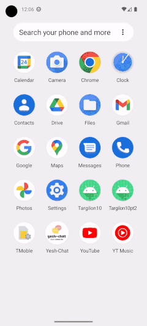
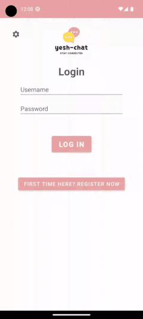

# Yesh-Chat Mobile App

**Welcome to Yesh-Chat!** :partying_face:	 
A messaging application developed using Android Studio, supported by a a Node.js [server-side](https://social-chat-app-21.onrender.com/).
Get a seamless communication and fun chats with your friends and family and feel the joy of instant messaging exprience.  
This Android application serves as an extension of the [Yesh-Chat website](https://social-chat-app-23.onrender.com/), Keeping you connected on the move with your personal device, ensuring you're always in touch with your contacts and conversations :people_hugging:	

## Features

The Yesh-Chat Android Application offers the following features:

- :registered: **User Registration**: Users can create a new account by providing their username, password, display name, and profile picture. These details are used to personalize the user's profile within the application.

- :woman_technologist:	**User Login**: Registered users can log into their accounts using their username and password. The login process validates the user's credentials and grants access to the application's features.

- :two_men_holding_hands:	**Contact Management**: Users can add contacts to their list by searching their username. This allows users to establish connections and start conversations with their contacts.

- :speaking_head:	 **Messaging**: Users can communicate with their contacts through one-on-one conversations.

- :first_quarter_moon:	 **Theme Settings**: The application provides a screen settings feature that allows users to change the theme of the application according to their preferences. Personalize your chat experience with light and dark themes to match your mood.

- :floppy_disk:	**Server Connection Configuration**: The application allows users to change the server connection URL. By accessing the settings screen, users can modify the default server connection address to connect to a different server.

- :japanese_castle:	**Architecture**: The Yesh-Chat Android Application follows the View-ViewModel-Repository (MVVM) architectural pattern. This separation of concerns improves code organization, maintainability, and testability. The server side of the application is developed using Node.js. The server utilizes the mongoose library to connect to MongoDB for data storage.

  
## Live Demo 📱
Excited to try out Yesh-Chat right away? You can access our live demo APK package directly from the [Releases section](https://github.com/yeela8g/Yesh-Chat-Mobile-App/releases/tag/v1.0.0)!

Click on the APK file from your phone and enable installation from 'Unknown Sources', then install and start connecting with others or exploring the app's features !

## How to run

To set up and run Yesh-Chat Android Application, follow these steps:

1. **Prerequisites**: Make sure you have Android Studio. You will also need a compatible Android device or emulator to run the application.

2. **Clone the Repository**: Clone the project repository to your local machine.

3. **Build and Run**: Open the Android project in Android Studio and build the application. Run the application on your Android device or emulator.

4. **Explore and Enjoy**: Start adding contacts, sending messages, and customize the application theme according to your preferences.

## Technologies Used

The Yesh-Chat Android Application utilizes the following technologies:

- **Android Studio**: The integrated development environment (IDE) used for building the Android application.
- **Java**: The programming language used for Android app development.
- **Retrofit**: A type-safe HTTP client for Android used for server communication.
- **Gson**: A library used for JSON serialization and deserialization in the Android application.

And as for the server side:
- **Node.js**: The JavaScript runtime used for the server-side implementation.
- **Express**: A web application framework for Node.js used to create the server.
- **MongoDB**: A NoSQL database used for data storage, accessed through the mongoose library.

## Screenshots and GIFs

Here are some GIFs showcasing the activities of the WhatsApp Android Application:

## Screenshots and GIFs

Here are some GIFs showcasing the activities of the WhatsApp Android Application:

 
 
*Registration Activity*

 
 
*Chat Activity*

Thank you for using the Yesh-Chat Android Application! 
hope you enjoy the messaging experience it offers.   
